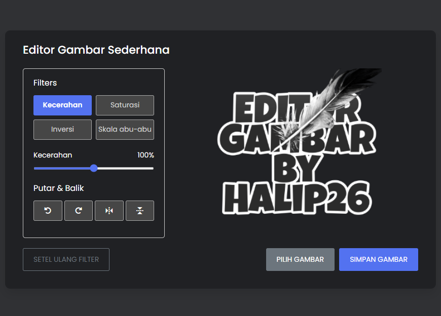

In this project (Image Editor in JavaScript), as you’ve seen in the preview image, users can apply different filters to their image like grayscale, inversion, saturation, and adjust the image brightness. Additionally, users can also rotate or flip the images and save their edited images.

This project is made with vanilla JavaScript. If you’re excited to view a demo of this image editor or want to know what this editor looks like. You can click link that I provided in description to view a live demo of this simple image editor.

---

### 💻 &nbsp;Preview

- 📫 How to reach me: &nbsp; 

---

### 🛠 &nbsp;Languages and Tools

&nbsp;
&nbsp;
&nbsp;

&nbsp;
&nbsp;

---

### 📑 &nbsp;License

[LICENSE](LICENSE)
